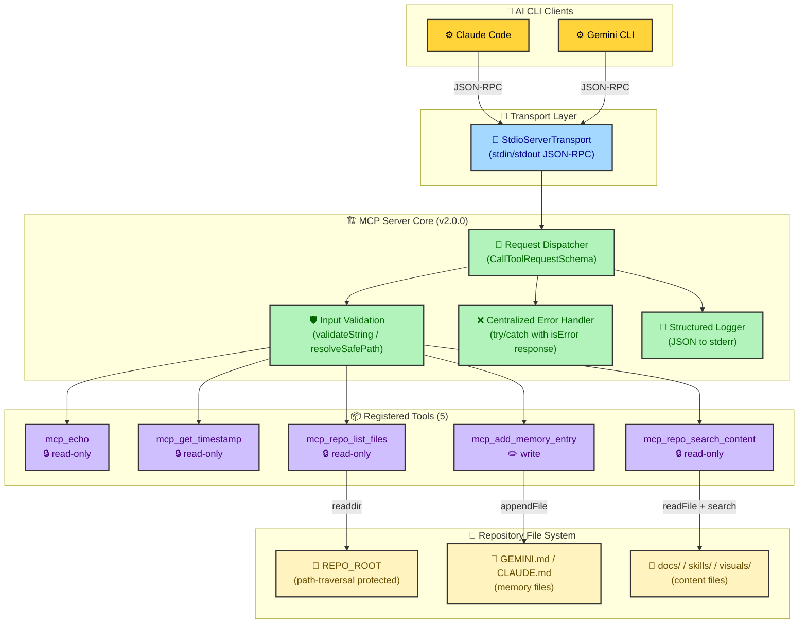

# Custom MCP Server — Architecture Overview

> Generated using the `design-doc-mermaid` skill on Day 17 of the 30-Day AI CLI Experimentation Plan.

## System Architecture

This diagram shows the high-level component layout of the custom MCP server (`mcp/custom-server/`), including transport, core dispatcher, tool registry, and external dependencies.

## Component Responsibilities

| Component | Responsibility |
|---|---|
| **StdioServerTransport** | Bridges stdin/stdout to JSON-RPC message protocol |
| **Request Dispatcher** | Routes `CallToolRequest` to the correct tool handler by name |
| **Input Validation** | Type checks, length limits, path traversal prevention |
| **Error Handler** | Catches all tool exceptions, returns structured `isError` responses |
| **Structured Logger** | Emits JSON log entries to stderr with timestamps and durations |
| **Tool Registry** | Maps of 5 tools with schemas, annotations, and handler functions |
