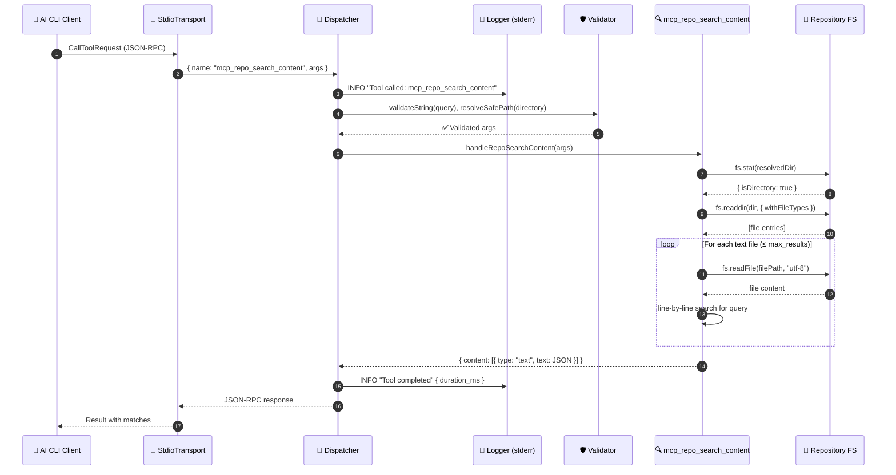
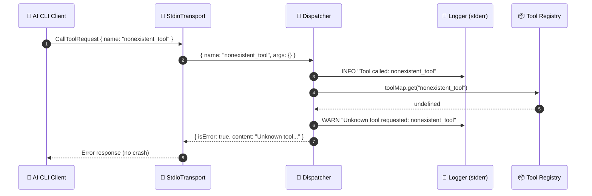
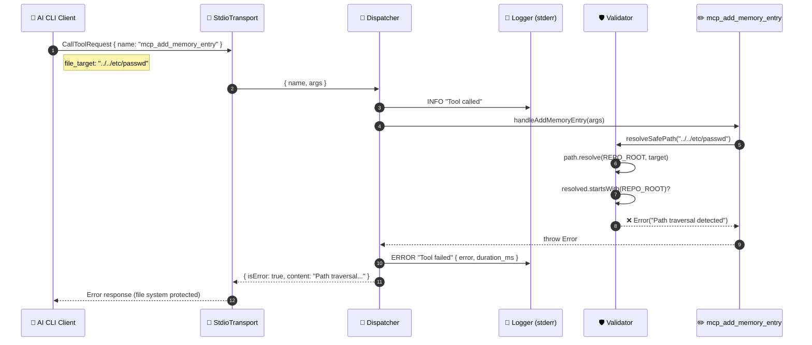
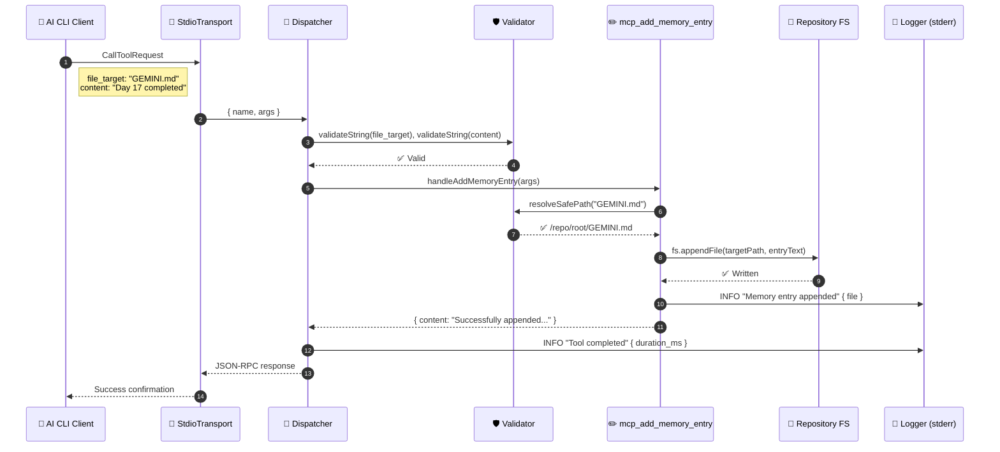

# Custom MCP Server — Tool Interaction Sequences

> Generated using the `design-doc-mermaid` skill on Day 17 of the 30-Day AI CLI Experimentation Plan.

## Sequence 1: Successful Tool Call (`mcp_repo_search_content`)

This diagram traces a complete successful request from the AI CLI client through transport, dispatcher, validation, tool execution, and structured logging.

## Sequence 2: Error Handling — Unknown Tool

This diagram shows how the server gracefully handles a request for a non-existent tool without crashing.

## Sequence 3: Error Handling — Input Validation Failure

This diagram shows the path traversal prevention in action when a malicious file path is provided.

## Sequence 4: Memory Entry Write Flow

This diagram shows the complete flow of `mcp_add_memory_entry` appending content to a memory file.

